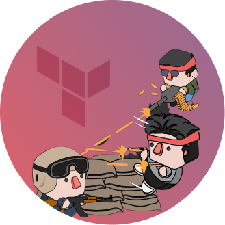

  

<h1 align="center">CS: GO Terraform Module</h1>

A Terraform module to implement a CS: GO Server on AWS. You can read more about this project in our <a href="https://techblog.zrp.com.br" target="_blank">TechBlog</a>.

The server is managed by <a href="https://linuxgsm.com/" target="_blank">Linux GSM (Game Server Manager)</a> and deployed to EC2. The game server will be automatically registered, and alerts will be emitted to a webhook (if provided).

## Deployment

Copy the example on `examples/complete`. then:

1. Generate a GSLT token from Steam (access https://steamcommunity.com/dev/managegameservers to generate, use app_id 730).
2. Update the configuration of main.tf to match yours.
3. Run terraform init.
4. Run terraform plan.
5. Run terraform apply.
6. Wait until setup is finished.

> The initial setup usually takes ~30min.

An id_rsa.pem and an id_rsa.pub files will be created in your module root folder.

Use the id_rsa.pem (the private key) to connect to the server.

## Manage the Server

1. SSH into the instance using user **csgoserver** (`ssh -i id_rsa.pem csgoserver@<server ip>`);
2. Manipulate the server using `./csgoserver <command>`;

You can get a list of commands using just `./csgoserver`;

## Using VNC

1. SSH into the instance
2. Run `vncpasswd` and crete a password (answer no view only password);
3. Start the vncserver using `vncserver -localhost no`
4. Connect using a VNC Client (e.g. TigerVNC) using `<server_ip>:1` and provide the password you've just configured.

## Connecting to server in Game

1. Enable Developer Console in `Settings > Game`.
2. Open the console using `'`.
3. Type `connect csgo.<provided_domain>` or `connect <instance_ip>`.

> If a password was provided, instead use `connect <ip>; password <pass>`.

## Using RCON within your server

1. Ensure you have connected to your server using the instructions above.
2. Open the in-game developer console by pressing the tilde (~) key.
3. Type `rcon_address <server_ip>` to set your rcon_address;
4. Type `rcon_password <your_password>` to set your password;
5. Confirm rcon is working by issuing `rcon status` in the console;

## Variables

The following table describes the available variables.

| variable          | type   | description                                   | default                  | required |
| ----------------- | ------ | --------------------------------------------- | ------------------------ | -------- |
| app               | string | The name of this application                  | csgo                     |          |
| env               | string | The environment of the current application    | prod                     |          |
| subnet_id         | string | The public subnet id to host the ec2 instance | -                        | x        |
| instance_type     | string | The instance type                             | t3.large                 |          |
| gslt              | string | The server token provided by Steam            | -                        | x        |
| max_players       | string | The maximum number of players in this server  | 32                       |          |
| slack_webhook_url | string | The alerts webhook                            | -                        |          |
| sv_password       | string | The server password, empty means public       | -                        |          |
| sv_contact        | string | The e-mail of the server owner                | -                        |          |
| sv_tags           | string | The tags for the search system                | 64-tick,casual,dust2,zrp |          |
| sv_region         | string | The server region, defaults to World          | 255                      |          |

## Outputs

The following table contains the set of outputs generated by this module.

| output               | type   | description                          | sensitive |
| -------------------- | ------ | ------------------------------------ | --------- |
| public_ssh_key       | string | The public ssh key                   |           |
| private_ssh_key_path | string | The SSM path for the SSH private key |           |
| instance_public_ip   | string | The instance ip                      |           |
| instance_arn         | string | The instance arn                     |           |
| rcon_password        | string | The server rcon password             | x         |

